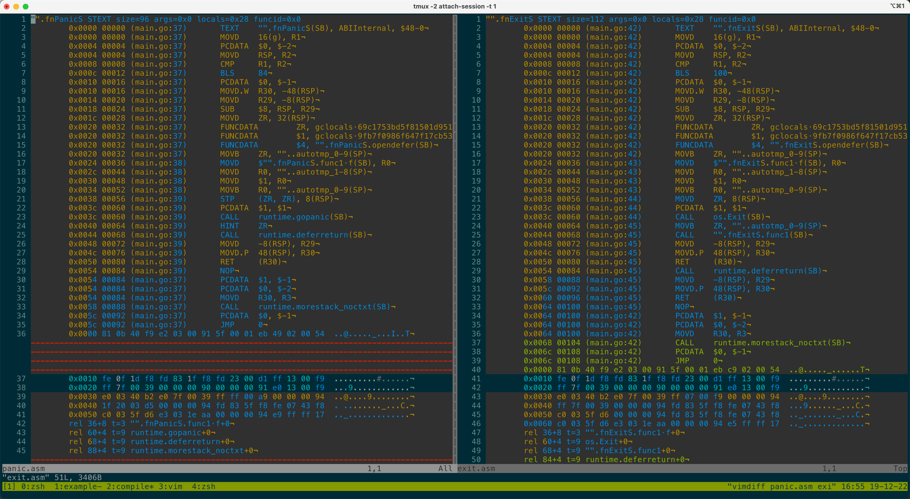

# [GoLang] panic 和 exit 对 defer 的影响

起因是观察到日志库 [rs/zerolog]() 中的 `log.Fatal()` 会导致当前函数中的 defer 没有被执行, 而 `log.Panic()` 则不会.
```go
➜  go-exit-without-defer git:(main) ✗ cat main.go
package main

import (
        "flag"
        "fmt"
        "os"
)

func main() {
        runPanic := flag.Bool("panic", true, "run panic")

        flag.Parse()

        if *runPanic {
                fnPanic()
        } else {
                fnExit()
        }
}

func fnPanic() {
        defer fn()
        fmt.Println("panic will trigger defer be executed")
        panic(nil)
}

func fnExit() {
        defer fn()
        fmt.Println("os.Exit will not trigger defer be executed")
        os.Exit(0)
}

func fn() {
        fmt.Println("defer be executed")
}
➜  go-exit-without-defer git:(main) ✗ go run main.go
panic will trigger defer be executed
defer be executed
panic: nil

goroutine 1 [running]:
main.fnPanic()
        /Users/j2gg0s/go/src/github.com/j2gg0s/j2gg0s/examples/go-exit-without-defer/main.go:24 +0x90
main.main()
        /Users/j2gg0s/go/src/github.com/j2gg0s/j2gg0s/examples/go-exit-without-defer/main.go:15 +0xd0
exit status 2
➜  go-exit-without-defer git:(main) ✗ go run main.go --panic=false
os.Exit will not trigger defer be executed
```

`log.Fatal` 中调用的是 `os.Exit` 来退出, 而 `log.Panic` 中调用的是 `panic`.
`os.Exit` 的[文档](https://pkg.go.dev/os#Exit)中明确指出了会导致 `defer` 被忽略,
只是当没有遇到相关的案例时可能都不会注意.

不过在注意到这个场景后我们可能需要纠结在某些场景下使用 `panic` 还是 `os.Exit` 了.

在往下走一步, 为什么 `os.Exit` 会导致 `defer` 没有被执行呢?
通过浏览生成的汇编代码可以直观的看到原因.
下图左侧是 fnPanicS 生成的汇编代码, 右侧为 fnExitS.
Line 28 显示 `os.Exit` 直接导致了函数返回, 进而导致的编译器插入的 Line 29 runtime.deferreturn 没有被执行.



[rs/zerolog]: https://github.com/rs/zerolog.git
