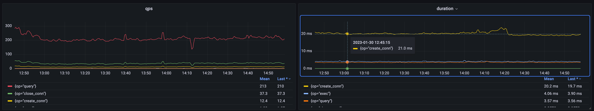
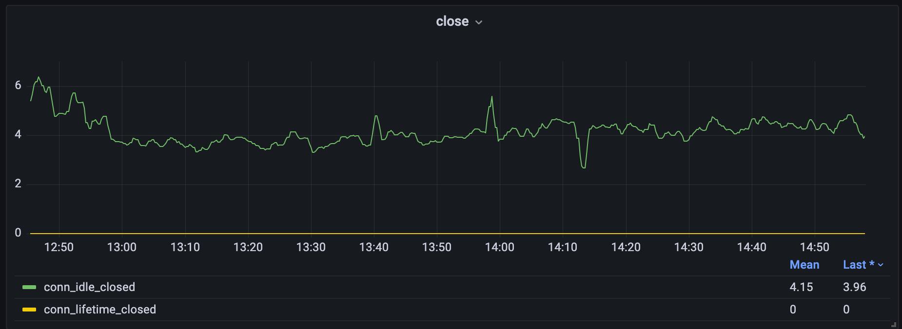
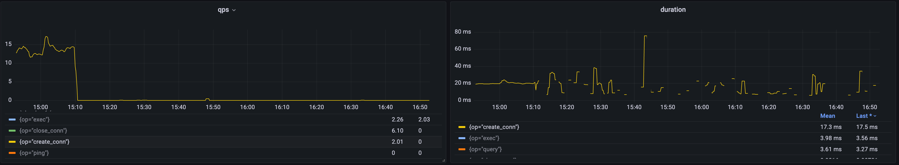
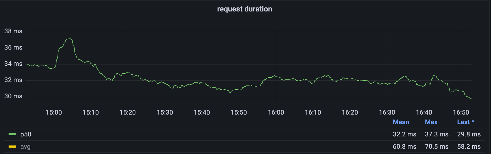

# [GoLang] 优化连接池: 以 database/sql 为例

之前就看到有些应用在频繁的创建/关闭数据库链接, 这样的行为大概率不是正确的.

MySQL 的链接是昂贵, 在上图也可以看到 create 耗时远超 query 和 exec,
所以大多数的实现都会选择通过链接池来复用已创建的链接.

Go 的 [database/sql]() 也不例外, 你可以通过以下几个参数来调整具体的行为:
- MaxIdleConns, 最大空闲链接数量, 默认为 2.
当程序尝试将使用完的链接放回连接池时, 如果当前的空闲链接数量大于等于 MaxIdleConns,
则会直接关闭并链接释放.

- MaxOpneConns, 同时存在的链接数量的最大值, 默认不限制.
这个参数可以避免系统因为突发的, 瞬间的流量而打开大量的数据库链接, 起到保护数据库的作用.

- ConnMaxLifetime, 链接的最大存活时间, 默认不限制.
- ConnMaxIdleTime, 链接的最大空闲时间, 默认不限制.

当发现应用持续的大量创建链接, 我们首先需要判断为什么.
通过 [database/sql]() 自带的统计信息可以直观的发现链接主要是因为 idle 而被关闭的.

翻阅代码, 业务方也没有额外设置 ConnMaxIdleTime.
那么显然是因为 MaxIdleConns 设置的过小而导致链接被新建并使用后,
因为无法被放入连接池而直接关闭, 进而无法被复用.

此时, 我们可以通过调整 MaxIdleConns 提高链接的复用.
当我们把 MaxIdleConns 从默认的 2 调整到 8 之后, 可以发现链接的复用变得非常好.

同时, 可以观察到因为避免大量耗时的链接创建操作, 应用对外的响应时间也有了比较明显的降低.

虽然对于稳定的应用应该是 p99 收益最明显,
但是这个应用存在其他的耗时操作并主导了 p99. 
