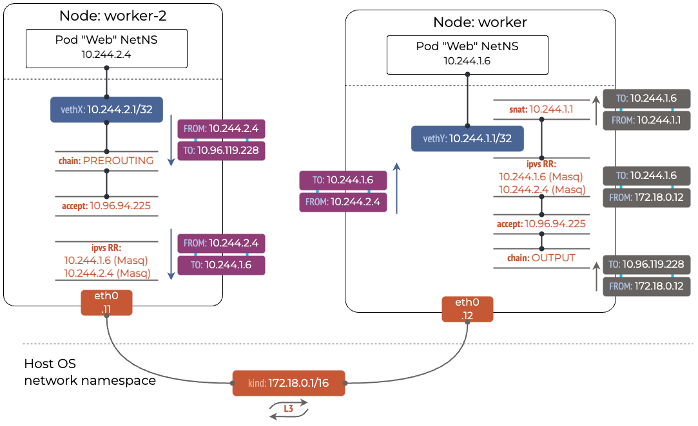

# [k8s] kube-proxy 和 CNI 的简单介绍

对于一个 L7 的使用者来说, 梳理 k8s 网络架构和实现的过程是一段奇妙的旅行.

## 典型场景
以托管在阿里云上的一个 k8s 集群为例来看集中典型的场景.
集群版本为 v1.22, kube-proxy 启用 IPVS, 网络插件是 flannel.
本文讲诉的场景包括:
- 同一 Node 上 Pod 之间的访问
- 不同 Node 上 Pod 之间的访问
- Pod 访问 Service
- 非 Pod 访问 Service

阿里云的 k8s 使用内部的 vpc 而不是 vxlan 作为 flannel 的后端, 整体和 vxlan 略有差异.

### 同一 Node 上 Pod 之间的访问


上图中的红色线路代表了同一 Node 上 Pod 之间的访问过程.
Pod 拥有自己独立的 Network Namespace, 实现互相之间的网络隔离.
为了让 Pod 之间可以直接访问, k8s 为每个 Pod 创建对应的
[veth](https://man7.org/linux/man-pages/man4/veth.4.html), virtual Ethernet,
并将所有的 veth 都绑定到同一个 [bridge](https://wiki.archlinux.org/title/network_bridge), 虚拟的交换机.

让我们来验证我们的理解.
Pod 内的请求都会通过 eth0 流向 172.30.3.1
```bash
~ kubectl exec -ti -n $NS $POD_NAME -- route -n
Kernel IP routing table
Destination     Gateway         Genmask         Flags Metric Ref    Use Iface
0.0.0.0         172.30.3.1      0.0.0.0         UG    0      0        0 eth0
172.30.0.0      172.30.3.1      255.255.0.0     UG    0      0        0 eth0
172.30.3.0      0.0.0.0         255.255.255.192 U     0      0        0 eth0
```

172.30.3.1 是 Node 上由 k8s 创建的虚拟网卡 cni0
```bash
~ ifconfig cni0
cni0: flags=4163<UP,BROADCAST,RUNNING,MULTICAST>  mtu 1500
        inet 172.30.3.1  netmask 255.255.255.192  broadcast 172.30.3.63
        ether 66:c2:ce:f0:4f:cb  txqueuelen 1000  (Ethernet)
        RX packets 815780203356  bytes 615383987128323 (559.6 TiB)
        RX errors 0  dropped 0  overruns 0  frame 0
        TX packets 907300951171  bytes 1309010367391989 (1.1 PiB)
        TX errors 0  dropped 0 overruns 0  carrier 0  collisions 0
```

上述的 eth0 和 cni0 位于不同的 network namespace, 并不能直接访问.
需要通过 veth 的中转, 面向 Google 而不是 ChatGPT, 我们可以定位到具体的 veth:
```bash
~ kubectl exec -ti -n $NS $POD_NAME -- cat /sys/class/net/eth0/iflink
329412
~ ip link show | grep 329412
329412: veth063a3cfd@if3: <BROADCAST,MULTICAST,UP,LOWER_UP> mtu 1500 qdisc noqueue master cni0 state UP mode DEFAULT group default
```

### 不同 Node 上 Pod 之间的访问
阿里云的 vpc 直接针对 Node 的 PodCIDR 做路由表, 所以当不同 Node 上 Pod 之间的访问几乎没有额外的工作.
根据 Node 上路由表, 访问非本机 Pod 的流量会直接放行到 vpc.
```bash
~ route -n
Kernel IP routing table
Destination     Gateway         Genmask         Flags Metric Ref    Use Iface
0.0.0.0         10.xx.yyy.zzz   0.0.0.0         UG    0      0        0 eth0
172.30.3.0      0.0.0.0         255.255.255.192 U     0      0        0 cni0
```

### Pod 访问 Service
k8s 支持通过 Service 来访问背后的 Pod, kube-proxy 负责将流量按指定规则分配到对应的 Pod.



[ipvs](https://en.wikipedia.org/wiki/IP_Virtual_Server) 类似 L4 级别的负载均衡.
flannel 会监听 Service 和 EndpointSlices 变化并推送到 ipvs.
```bash
kubectl get -n $NS svc $SVC_NAME
NAME         TYPE        CLUSTER-IP     EXTERNAL-IP   PORT(S)                     AGE
xxxxxxxxxx   ClusterIP   172.31.12.98   <none>        8080/TCP,80/TCP,50051/TCP   2y300d
[root@ashg_prd_k8s_node_01 ~]# ipvsadm -l -t 172.31.12.98:50051
Prot LocalAddress:Port Scheduler Flags
  -> RemoteAddress:Port           Forward Weight ActiveConn InActConn
TCP  172.31.12.98:50051 rr
  -> 172.30.0.12:50051            Masq    1      0          0
  -> 172.30.0.16:50051            Masq    1      0          0
  -> 172.30.3.12:50051            Masq    1      0          0
  -> 172.30.3.13:50051            Masq    1      0          0
```

同时, ipvs 通过 netfilter 的钩子, 在 PREROUTING , 将指向 Service 的流量做一次 DNAT 后导向对应的 Pod.

### 非 Pod 访问 Service
当在某个节点上, 不通过 Pod 访问 Service 时, 需要额外做一次 SNAT.
```bash
~ iptables -t nat -L OUTPUT | column -t
Chain          OUTPUT  (policy  ACCEPT)
target         prot    opt      source    destination
KUBE-SERVICES  all     --       anywhere  anywhere     /*        kubernetes  service   portals  */
DOCKER         all     --       anywhere  !loopback/8  ADDRTYPE  match       dst-type  LOCAL
~ iptables -t nat -L KUBE-SERVICES | column -t
Chain               KUBE-SERVICES  (2   references)
target              prot           opt  source          destination
KUBE-LOAD-BALANCER  all            --   anywhere        anywhere     /*         Kubernetes          service   lb       portal  */  match-set  KUBE-LOAD-BALANCER  dst,dst
KUBE-MARK-MASQ      all            --   !172.30.0.0/16  anywhere     /*         Kubernetes          service   cluster  ip      +   port       for                 masquerade  purpose  */  match-set  KUBE-CLUSTER-IP  dst,dst
KUBE-NODE-PORT      all            --   anywhere        anywhere     ADDRTYPE   match               dst-type  LOCAL
ACCEPT              all            --   anywhere        anywhere     match-set  KUBE-CLUSTER-IP     dst,dst
ACCEPT              all            --   anywhere        anywhere     match-set  KUBE-LOAD-BALANCER  dst,dst
```

## References

- [IPVS-Based In-Cluster Load Balancing Deep Dive](https://kubernetes.io/blog/2018/07/09/ipvs-based-in-cluster-load-balancing-deep-dive/)
- [A Deep Dive into Iptables and Netfilter Architecture](https://www.digitalocean.com/community/tutorials/a-deep-dive-into-iptables-and-netfilter-architecture)
- [THE KUBERNETES NETWORK MODEL](https://www.tkng.io/services/clusterip/dataplane/ipvs/)
