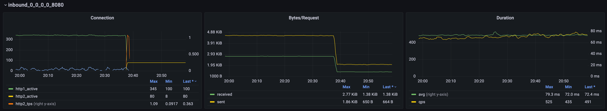

集群内业务系统使用 HTTP 对外提供 API.
由于历史原因, Gateway 和业务系统之间使用 HTTP/1.1.
在很早之前我就想尝试将其变更为 HTTP/2, 直接原因是因为集群内巨大的网络流量让我很没有安全感.

## 直观影响
在将一个服务从 HTTP/1.1 升级到 HTTP/2 之后,
依赖于 Envoy 提供的[统计数据](https://www.envoyproxy.io/docs/envoy/latest/configuration/http/http_conn_man/stats#config-http-conn-man-stats), 可以观察到最基本的变化:

- 有赖于多路复用, 活跃的链接数量大幅减少,
- 同时, 链接的复用更彻底, 基本不再有链接的销毁与新建
- 单个请求的体积大幅减少, 大概率是请求头压缩带来的直观结果
- 请求耗时没有明显变化

## h2 和 h2c
HTTP/2 是一次兼容 HTTP/1.1 的大升级,
所以客户端首先需要通过 TLS 的 [ALPN extension](https://www.rfc-editor.org/rfc/rfc7301.html) 确定服务端支持 HTTP/2.

虽然 HTTP/2 自身并不依赖 TLS, 但绝大多数的实现 (Chrome/Firfox/GoLang) 都强制要求 HTTP/2 使用 TLS.
我们一般将基于 ALPN, 使用了 TLS 加密的 HTTP/2 简称为 h2.

于 h2 相对的是 h2c, HTTP/2 over cleartext TCP, 直接使用 TCP 的 HTTP/2.
h2c 中, 客户端直接在请求头中设置 Upgrade 为 h2c.
和 websocket 类似, 服务端如果直接 h2c, 则直接返回 101.

GoLang 的官方网络库 net/http 只支持 h2, 需要手动引入 [x/net/http2/h2c](https://pkg.go.dev/golang.org/x/net/http2/h2c) 来支持 h2c.

## 在 Envoy 中使用 h2/h2c
我个人的习惯是直接使用
[appProtocol](https://kubernetes.io/docs/reference/generated/kubernetes-api/v1.27/#serviceport-v1-core) 指明端口的协议为 http2.

Istio 会在对应 Cluster 的 [typed_extension_protocol_options](https://www.envoyproxy.io/docs/envoy/latest/api-v3/config/cluster/v3/cluster.proto#config-cluster-v3-cluster) 中通过
[HttpProtocolOptions](https://www.envoyproxy.io/docs/envoy/latest/api-v3/extensions/upstreams/http/v3/http_protocol_options.proto) 指明 h2.
```json
{
  "envoy.extensions.upstreams.http.v3.HttpProtocolOptions": {
    "@type": "type.googleapis.com/envoy.extensions.upstreams.http.v3.HttpProtocolOptions",
    "explicit_http_config": {
      "http2_protocol_options": {}
    }
  }
}
```
